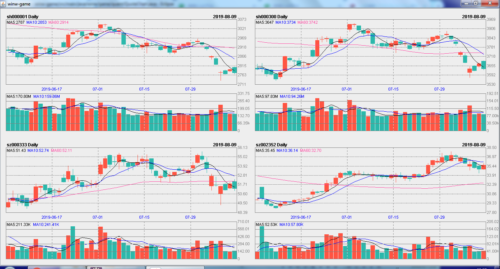
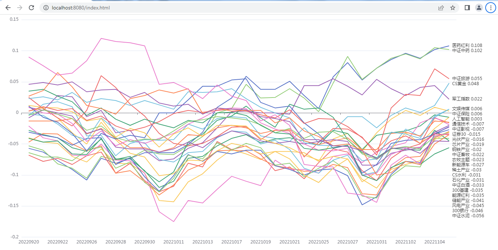
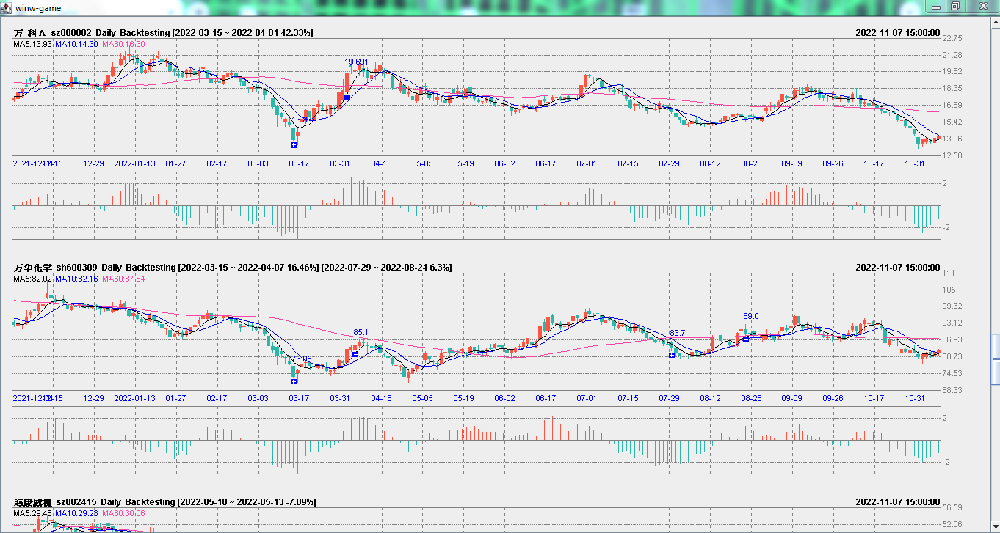

<table style="border:0">
	<tr align="center">
		<td></img>&nbsp;&nbsp;</td>
		<td>winw-game 
			<a style="text-decoration:none">https://github.com/winwjava/winw-game</a></td>
	</tr>
</table>

# 
## Quote Chart View

## Subect Index Data View

## Back Testing Data View

#### 量化策略

<table style="width: 900px;"  border="1px" cellpadding="0" cellspacing="0" >

  <tr><th>策略简称</th><th>策略实现</th><th>策略说明</th></tr>
  <tr><td>趋势跟踪</td><td>TrendFollowingStrategy</td><td>在向上趋势形成后买入，趋势向下后卖出；</td></tr>
  <tr><td>均值回归</td><td>TrendFollowingStrategy</td><td>过度下跌后买入，预期将恢复到接近平均位置卖出；</td></tr>
  <tr><td>黄金交叉</td><td>GoldenCrossStrategy</td><td>根据 MACD 的金叉死叉判断多空双方的力量判断做多或做空；</td></tr>
  <tr><td>利弗莫尔</td><td>LivermoreStrategy</td><td>华尔街投机大鳄“利弗莫尔”的买卖法则，适合跟随“涨停敢死队”操作；</td></tr>
  <tr><td>微笑曲线</td><td>SmileCurveStrategy</td><td>对于波动较低的行业，按价格走势的不同阶段分批买入，分批卖出；</td></tr>
  <tr><td>日内突破</td><td>IntradayBreakthroughStrategy</td><td>根据“唐安奇通道”或“布林线”，向上突破时买入，向下突破时卖出；</td></tr>
  <tr><td>日内趋势</td><td>IntradayTrendStrategy</td><td>在向上趋势形成后买入，趋势向下后卖出，判断错误时需要及时止损；</td></tr>
  <tr><td>日内倒卖</td><td>IntradayScalpStrategy</td><td>低价吸收筹码，高价卖出，适合炒作大宗商品，日内交易避免隔夜风险；</td></tr>
  <tr><td>对冲套利</td><td>HedgeArbitrageStrategy</td><td>一般属于高频交易：跨市场套利、期货与现货套利、配对交易套利；</td></tr>

</table>

#### 法律法规
<a href=
"http://www.csrc.gov.cn/pub/zjhpublic/G00306201/201510/t20151009_284758.htm">
《证券期货市场程序化交易管理办法（征求意见稿）》</a>摘录：
<li>程序化交易是指通过既定程序或特定软件，自动生成或执行交易指令的交易行为。
<li>程序化交易者需要事先进行信息申报，经核查后方可进行程序化交易；
<li>证券公司、期货公司的客户进行程序化交易的，应当事前将身份信息、策略类型、程序化交易系统技术
配置参数、服务器所在地址以及联络人等信息及变动情况向接受其交易委托的证券公司、期货公司申报，证券公司、期
货公司核查后方可接受该客户的程序化交易委托，并在委托协议中对相关事项进行约定。
<li>中国证监会根据监管执法需要，可以要求程序化交易者提供交易程序源代码、交易策略详细说明等相关材料；

## Create an empty git repository
useradd code -g winw  
chmod 770 /home/code  
su - code  
git init --bare winw-game.git  

## Use git
git clone /home/code/winw-game.git  
git clone code@192.168.1.10:/home/code/winw-game.git  
git config --global credential.helper store
git pull  
git add .  
git commit -m "first commit"  
git push origin master  

## Use crontab
50 14 * * 1-5 cd winw-game && git pull | awk '{print strftime("\%F \%T git pull -"),$0}' >> logs/app.log
54 14 * * 1-5 cd winw-game && export DISPLAY=:0 && . ~/.profile && mvn -q spring-boot:run >> logs/app.log
## Startup h2database web server.
java -cp ~/.m2/repository/com/h2database/h2/1.4.199/*.jar org.h2.tools.Server -web -webPort 8082 -webAllowOthers  

## Install JDK & Maven.
yum install java-latest-openjdk.x86_64  
wget https://www-eu.apache.org/dist/maven/maven-3/3.6.1/binaries/apache-maven-3.6.1-bin.tar.gz  
tar -xf /root/apache-maven-3.6.1-bin.tar.gz -C /usr/lib/  
echo "export JAVA_HOME=/usr/lib/jvm/java-12-openjdk-12.0.2.9-1.rolling.el7.x86_64" >> /etc/profile  
echo "export PATH=/usr/lib/apache-maven-3.6.1/bin:$PATH" >> /etc/profile  

