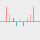

<table style="border:0!important;">
	<tr align="center">
		<td></img>&nbsp;&nbsp;</td>
		<td>winw-game 
			<a style="text-decoration:none">https://github.com/winwjava/winw-game</a></td>
	</tr>
</table>

## Create an empty git repository
useradd code -g winw  
chmod 770 /home/code  
su - code  
git init --bare winw-game.git  

## Use git
git clone /home/code/winw-game.git  
git clone code@192.168.1.10:/home/code/winw-game.git  
git config --global credential.helper store
git pull  
git add .  
git commit -m "first commit"  
git push origin master  

## Use crontab
55 14 * * * sh -c 'cd winw-game && git pull >> logs/app.log && mvn -q spring-boot:run >> logs/app.log'  

## Startup h2database web server.
java -cp ~/.m2/repository/com/h2database/h2/1.4.199/*.jar org.h2.tools.Server -web -webPort 8082 -webAllowOthers  

## Install JDK & Maven.
yum install java-latest-openjdk.x86_64  
wget https://www-eu.apache.org/dist/maven/maven-3/3.6.1/binaries/apache-maven-3.6.1-bin.tar.gz  
tar -xf /root/apache-maven-3.6.1-bin.tar.gz -C /usr/lib/  
echo "export JAVA_HOME=/usr/lib/jvm/java-12-openjdk-12.0.2.9-1.rolling.el7.x86_64" >> /etc/profile  
echo "export PATH=/usr/lib/apache-maven-3.6.1/bin:$PATH" >> /etc/profile  
